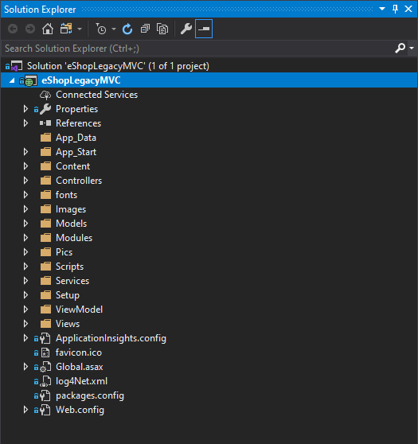

# Example migration of eShop to ASP.NET Core

[!INCLUDE [book-preview](../../../includes/book-preview.md)]

In this chapter you'll see how to migrate a .NET Framework app to .NET Core. The chapter will examine a sample online store app written for ASP.NET 5 and will go leverage many of the concepts and tools described earlier in this book. You'll find the starting point application in the [eShopModernizing GitHub repository](https://github.com/dotnet-architecture/eShopModernizing). There are several different starting point apps; this chapter will focus on the `eShopLegacyMVCSolution`.

The initial version of the project is shown in Figure 4-1. It's a fairly standard ASP.NET MVC 5 app.

**Figure 4-1. The eShopModernizing MVC sample project structure.**

## Run ApiPort to identify problematic APIs

The first step in preparing to migrate is to run the ApiPort tool to get a sense of how many .NET Framework APIs the app calls, and how many of these have .NET Standard or .NET Core equivalents. Focus primarily on your own app's logic, not third party dependencies, and pay attention to System.Web dependencies that will need to be ported.

- Run the ApiPort tool
- Show figures with results

## Update project files and NuGet reference syntax

The next step is to migrate from the older .csproj file structure to the newer, simpler one introduced with .NET Core. In doing so, you will also migrate from using a packages.json file for NuGet references to using `<PackageReference>` elements in the project file.

- Show original project file and nuget references
- Show updated project file

A common way to create a new project file for an existing ASP.NET project is to create a new ASP.NET Core app using `dotnet new` or `File - New - Project` in Visual Studio. Then files can be copied from the old project to the new one to complete the migration.

## Create new ASP.NET Core project

- Copy over common .cs files (controllers, models, viewmodels, etc.)

## Migrate app startup components

- Migrate Global.asax items
    - Show migrations for CORS, filters, route constraints, etc.
    - Show how to configure MVC with binders, formatters, areas, DI
- Migrate DI (if present previously)
  - Integrating Autofac with eShop and updating it for .NET Core
- Migrate configuration (web.config to appsettings.json etc.)
    - Show strategies to co-exist old and new config especially if needed by dependent (.NET Standard) libraries
    - Update framework features that depended on configuration (WCF client, tracing) to be configured in code instead

## Data access

- Data access with EF
  - Migrating EF6 as-is
  - Pros and Cons of EF6 vs. EF Core
  - Upgrading to EF Core
- Discuss other data providers

## Migrating static files and resources

The existing ASP.NET MVC app has static files spread among several different folders, like `Images`, `fonts`, and `Scripts`. These need to be moved to a special subfolder in the ASP.NET Core app, named `wwwroot` by default.

## References

- [eShopModernizing GitHub repository](https://github.com/dotnet-architecture/eShopModernizing)

>[!div class="step-by-step"]
>[Previous](strategies-migrating-in-production.md)
>[Next](deployment-scenarios.md)
